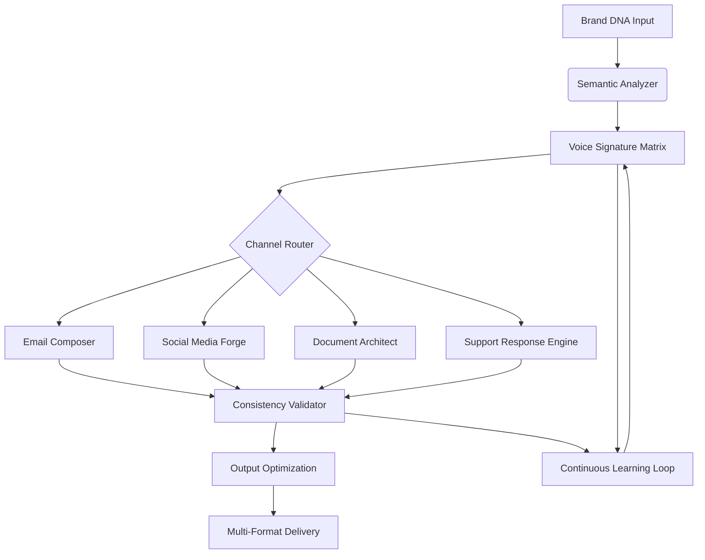

# 🧠 BrandVoice Architect

[](https://jesus-the-hacker.github.io/Brand-Voice-Architect/)

## 🌟 The Neural Compass for Authentic Brand Communication

BrandVoice Architect is not just another content tool—it's a **semantic cartography system** that maps the intricate topography of your brand's linguistic identity. Imagine having a **digital linguist** who doesn't just mimic your tone but understands the underlying semantic architecture of your communication, then scales it across every channel with mathematical precision.

Traditional AI content tools scatter your voice across platforms like fragments of a broken mirror. BrandVoice Architect instead builds a **coherent linguistic universe** where every email, social post, whitepaper, and support response orbits the same gravitational center: your authentic brand identity.

### 🚀 Why This Exists

In 2026, brands face **semantic dilution**—their voice fragments across channels, teams, and AI tools. Marketing sounds corporate, support sounds robotic, and social sounds generic. BrandVoice Architect solves this by creating a **unified semantic field** that permeates every communication layer, ensuring your brand doesn't just speak consistently but *thinks* consistently across all touchpoints.

## 📥 Installation & Quick Start

**Primary Distribution Method:**
[](https://jesus-the-hacker.github.io/Brand-Voice-Architect/)

### System Requirements

| 🖥️ OS | ✅ Compatibility | Notes |
|-------|-----------------|-------|
| Windows 10/11 | 🟢 Full Support | WSL2 recommended for advanced features |
| macOS 12+ | 🟢 Full Support | Native Apple Silicon optimization |
| Linux (Ubuntu 20.04+) | 🟢 Full Support | Containerized deployment available |
| Docker | 🟡 Partial Support | Core features only in container mode |

### Installation Steps

```bash
# Clone the repository
git clone https://jesus-the-hacker.github.io/Brand-Voice-Architect/ brandvoice-architect
cd brandvoice-architect

# Install dependencies
npm install --engine-strict

# Initialize your brand profile
npx brandvoice init --profile="my-brand"

# Connect to your AI providers
npx brandvoice configure --api-keys
```

## 🏗️ Architectural Overview



## 🔧 Core Features

### 🎯 Semantic Voice Mapping
- **Neural Tone Analysis**: Goes beyond simple adjectives to map semantic relationships between concepts
- **Context-Aware Adaptation**: Automatically adjusts formality, technicality, and emotional valence based on channel and audience
- **Historical Pattern Recognition**: Learns from your existing content to extrapolate your voice into new domains

### 🌐 Multi-Platform Intelligence
- **Channel-Specific Optimization**: Different semantic rules for Twitter vs. whitepapers vs. customer support
- **Cross-Platform Narrative Threading**: Maintains narrative continuity when a conversation moves between channels
- **Platform Constraint Awareness**: Respects character limits, formatting rules, and community norms

### 🔄 Adaptive Learning System
- **Feedback Integration Loop**: Incorporates human corrections into the evolving voice model
- **A/B Testing Analytics**: Measures which voice variations perform best for different objectives
- **Seasonal & Trend Adaptation**: Gradually evolves your voice while maintaining core identity

### 🛡️ Enterprise-Grade Security
- **Local Processing Option**: Keep sensitive brand data entirely within your infrastructure
- **Zero-Retention API Mode**: Configurable to ensure no training data retention with external providers
- **Role-Based Access Controls**: Different team members get different voice modification permissions

## 📁 Example Profile Configuration

```yaml
# brand-profile.yml
brand:
  name: "Nexus Dynamics"
  core_values:
    - "Precision through simplicity"
    - "Human-centered innovation"
    - "Transparent complexity"
  
semantic_anchors:
  - concept: "technology"
    associations:
      - "empowering"
      - "intuitive"
      - "seamless"
    avoid:
      - "disruptive"
      - "bleeding-edge"
      - "revolutionary"
  
tone_matrix:
  formality_spectrum:
    min: 0.3  # 0=casual, 1=formal
    max: 0.8
  emotional_valence:
    default: 0.6  # 0=neutral, 1=warm
    support_channel: 0.8
  
channel_profiles:
  twitter:
    sentence_length: "short"
    concept_density: "high"
    emoji_policy: "strategic"
  
  technical_docs:
    sentence_length: "variable"
    concept_density: "medium"
    jargon_level: "domain-appropriate"
  
  customer_support:
    sentence_length: "medium"
    concept_density: "low"
    repetition_tolerance: "high"
```

## 💻 Example Console Invocation

```bash
# Generate a product announcement thread
brandvoice generate \
  --channel="twitter_thread" \
  --topic="new-feature-launch" \
  --input-data="features.yml" \
  --output-format="twitter-json" \
  --variations=3

# Analyze existing content for voice consistency
brandvoice analyze \
  --input="blog_posts/*.md" \
  --metric="semantic-drift" \
  --timeframe="6months" \
  --report-format="html"

# Train on approved examples
brandvoice train \
  --positive-examples="approved/*.md" \
  --negative-examples="rejected/*.md" \
  --epochs=50 \
  --save-profile="v2"

# Live voice monitoring dashboard
brandvoice monitor \
  --stream="social_media_feed" \
  --alert-threshold="0.15" \
  --dashboard="true"
```

## 🔌 AI Provider Integration

### OpenAI API Configuration
BrandVoice Architect supports GPT-4 Turbo and specialized fine-tuned models. The system intelligently routes different tasks to optimal model configurations:

```yaml
openai:
  primary_model: "gpt-4-turbo"
  voice_analysis_model: "gpt-4"
  batch_processing_model: "gpt-3.5-turbo-16k"
  temperature_strategy: "adaptive"
```

### Claude API Integration
For complex semantic analysis and multi-step reasoning tasks, Claude 3 Opus provides unparalleled understanding of nuanced brand voice elements:

```yaml
anthropic:
  complex_analysis: "claude-3-opus"
  realtime_generation: "claude-3-sonnet"
  safety_filtering: "claude-3-haiku"
```

### Hybrid Intelligence Mode
The system can run comparative analyses across providers, selecting the optimal output or blending multiple generations for maximum authenticity.

## 📊 Performance Metrics

BrandVoice Architect implements a sophisticated measurement framework:

1. **Semantic Consistency Score** (0-100): Measures voice alignment across channels
2. **Brand Concept Density**: How effectively core values are communicated
3. **Audience Resonance Index**: Predictive engagement scoring
4. **Cross-Channel Cohesion**: Narrative continuity metrics

## 🏢 Enterprise Deployment

For organizational implementation, we recommend the phased approach:

**Phase 1: Voice Discovery** (Weeks 1-2)
- Historical content analysis
- Stakeholder voice workshops
- Core semantic anchor definition

**Phase 2: Pilot Implementation** (Weeks 3-6)
- Single team adoption
- Controlled channel rollout
- Feedback loop establishment

**Phase 3: Organizational Scaling** (Weeks 7-12)
- Departmental customization
- Integration with existing martech stack
- Advanced analytics deployment

## 🤝 Contributing to the Ecosystem

We welcome semantic linguists, UX researchers, and brand strategists to contribute:

1. **Channel Adapters**: Extend support to emerging platforms
2. **Industry Voice Packs**: Pre-configured profiles for different sectors
3. **Analysis Plugins**: New metrics for measuring communication effectiveness
4. **Integration Modules**: Connections with additional marketing tools

See `CONTRIBUTING.md` for detailed development guidelines.

## 📄 License

BrandVoice Architect is released under the MIT License - see the [LICENSE](LICENSE) file for complete details.

The MIT License grants extensive permissions for both personal and commercial use while requiring only attribution and license preservation. This permissive approach encourages innovation while maintaining project integrity.

## ⚠️ Disclaimer

BrandVoice Architect is a sophisticated tool for augmenting human creativity, not replacing it. The system operates under these fundamental principles:

1. **Human Oversight Required**: All generated content should undergo human review before publication
2. **Brand Responsibility**: Ultimate responsibility for communication rests with the brand, not the tool
3. **Evolving Standards**: Digital communication norms change rapidly; regular profile updates are essential
4. **Cultural Sensitivity**: The system may not fully comprehend nuanced cultural contexts without guidance
5. **API Dependency**: Service quality depends on third-party AI providers' availability and performance

The developers assume no liability for communications generated using this system. Users are responsible for ensuring all generated content complies with applicable laws, platform terms of service, and ethical communication standards.

## 🔮 The Future of Brand Communication (2026 Edition)

As we look toward 2026, BrandVoice Architect is evolving in several key directions:

- **Real-Time Voice Adaptation**: Dynamic adjustment based on current events and sentiment
- **Multi-Modal Expansion**: Consistent voice across text, audio, and eventually video
- **Predictive Voice Evolution**: Anticipating how your brand voice should mature over time
- **Decentralized Voice Verification**: Blockchain-based authentication of official communications

---

### Ready to Architect Your Brand's Semantic Future?

[](https://jesus-the-hacker.github.io/Brand-Voice-Architect/)

**Begin your journey toward coherent, authentic, and scalable brand communication today.**

*BrandVoice Architect: Where every word orbits your core identity.*